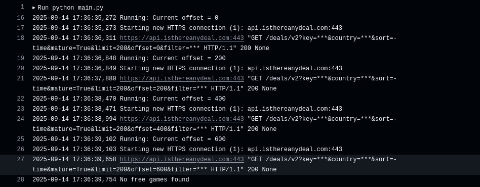
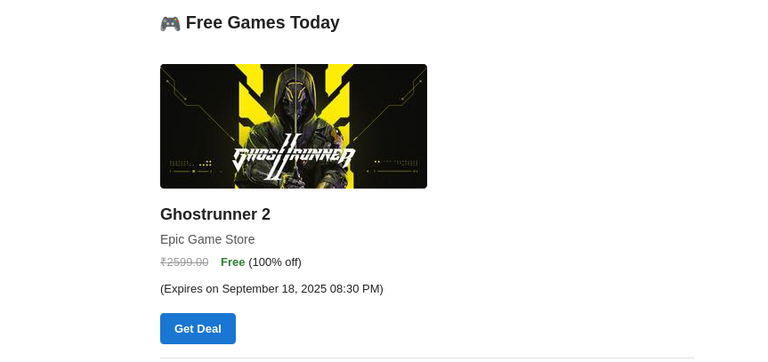

# 🎮 Free Games Alert


Free Games Alert is a GitHub Actions-based script that checks for newly free games from popular platforms like Steam, Epic Games, and GOG using the IsThereAnyDeal API.

If any new free games have been added in the past 24 hours, you'll receive an email with the list — automatically.

## Features

* ✅ Fully automated via GitHub Actions

* 🆓 Scans Steam, Epic, and GOG for free games

* 📬 Sends you an email if new free games are found

* 🔁 Checks every 24 hours

* 🐳 Docker support included

## 🛠️ Installation

### 🔧 Run Locally
```bash
git clone https://github.com/Squikys/free_game_alert
cd free_game_alert
pip install -r requirements.txt
python main.py
```
### 🐳 Run with Docker
```bash
docker compose up
```

## 📦 Usage

### 💻 Console Output


### 📧 Email Notification Preview



## 🤝 Contributing

Pull requests are welcome. For major changes, please open an issue first
to discuss what you would like to change.


